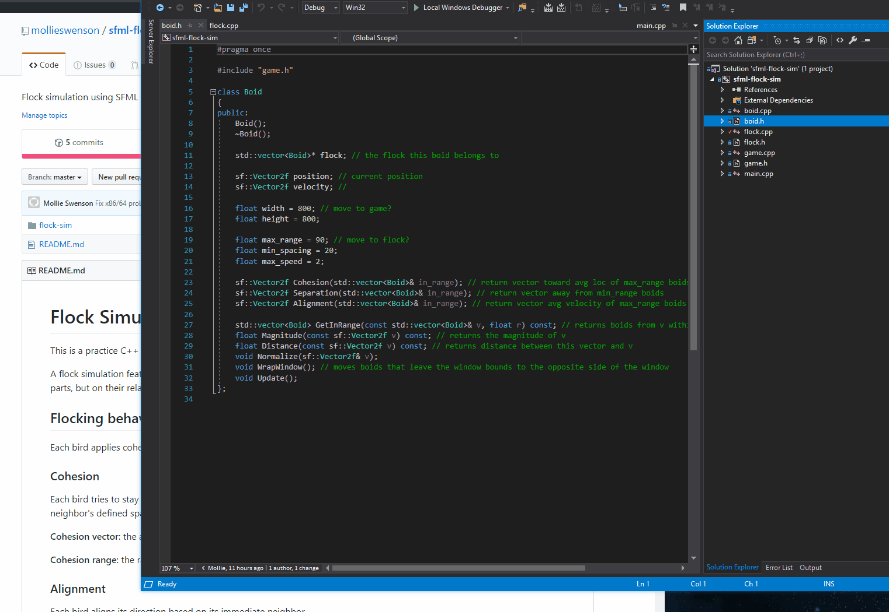

# Flock Simulation

This is a practice C++ project implementing a flock simulation (also known as boid, swarm, school) using [SFML](https://www.sfml-dev.org/). 

## Flocking behavior fundamentals

A flock simulation features **emergent behavior**, which is the behavior of a system that does not depend on its individual parts, but on their relationships to one another. Each boid applies **cohesion**, **alignment**, and **separation** rules to its neighbors within a limited range.

* **Cohesion**: Each boid travels toward its neighbors. The cohesion vector is the average velocity toward neighbors' center of mass.
* **Alignment**:  Each boid travels with its neighbors. The alignment vector is the average velocity of neighbors.
* **Separation**: Each boid avoids colliding with its neighbors. The separation vector is the average opposite velocity of neighbors.

## Pseudo code

I used this [Boids Pseudocode](http://www.kfish.org/boids/pseudocode.html) for reference. This project has the following classes.

* **`Game`** manages the window and takes care of drawing and rendering each boid per frame.
* **`Flock`** creates and manages a vector of `Boid` objects, which it initially sets with a random starting position and random starting velocity. While the game runs, its function `Update()` calls each `Boid`'s `Update()`. 
* **`Boid`** represents an individual boid, and they have their own `position` and `velocity` which determines their movements. They have a pointer to their `flock` so they can find other `Boid`'s, and ranges at which to apply their member functions `Cohesion()`, `Alignment()`, and `Separation()` are stored on the individual `Boid`.

## Visual Studio Setup 

Here's how to set up for 32-bit, assuming 32-bit compiler is available.

1. Download [Visual C++ 15 (2017) - 32-bit](https://www.sfml-dev.org/download/sfml/2.5.1/) and place at C:\Program Files (x86)\SFML-2.5.1.
2. Open sfml-flock-sim.sln and ensure the following settings in Project Properties
    * Configuration: Active (Debug/Release)
    * Platform: Win32
    * Configuration Manager > 
        * Active Solution Configuration: Debug/Release (set both)
        * Active Solution Platform: Win32 (both debug and release)
        * Project / Configuration / Platform / Build: sfml-flock-sim / Debug/Release / Win32 / True
    * C/C++ > General > Additional Include Directories > add Program Files(x86)\SFML-2.5.1\include
    * Linker > General > Additional Library Directories > add Program Files(x86)\SFML-2.5.1\lib
    * Linker > Input > Additional Dependencies > List of libs must match release/debug (below are debug)
        * `sfml-audio-d.lib`
        * `sfml-graphics-d.lib`
        * `sfml-window-d.lib`
        * `sfml-system-d.lib`
        * `sfml-main-d.lib`
        * `sfml-network-d.lib`
    * Linker > Advanced > Target Machine: MachineX86
3. Rebuild the project. Project > Rebuild (generates dir with executable).
4. Copy all .dlls from C:\Program Files (x86)\SFML-2.5.1\bin (32-bit versions) and paste into sfml-flock-sim/flock-sim/Debug
5. Should be able to run now. 