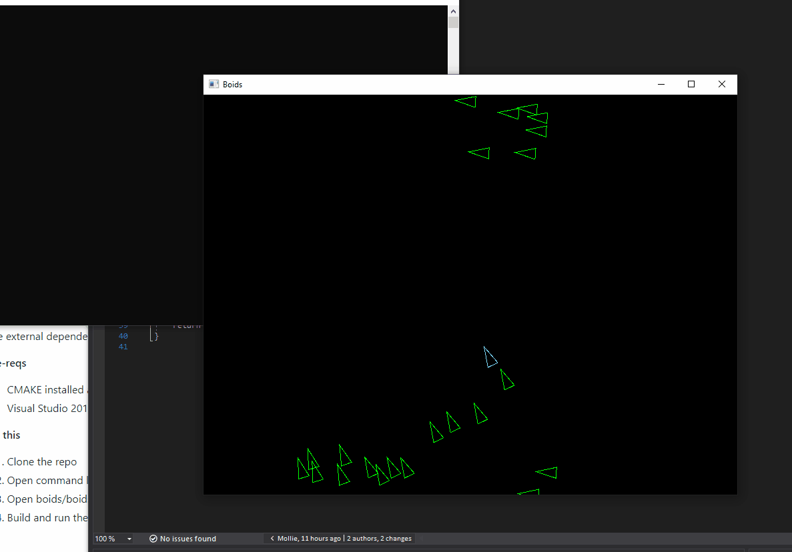
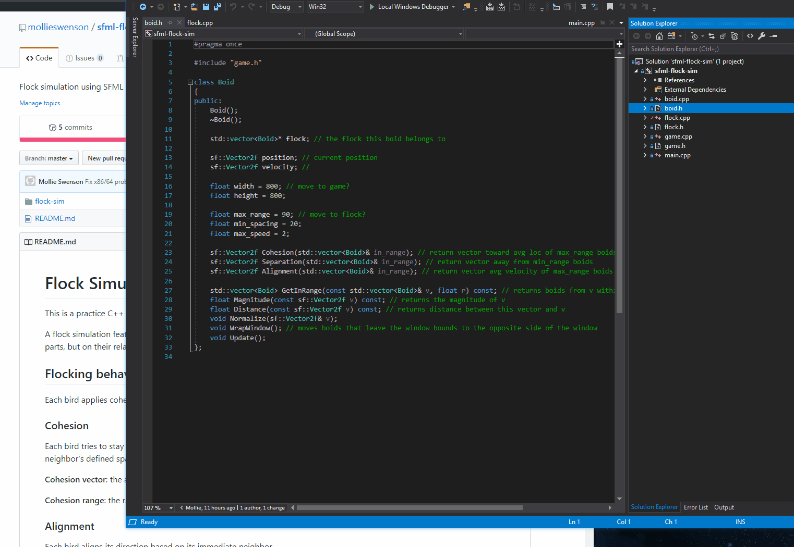

# Boids (Flock Simulation)

This is a practice C++ project implementing a flock simulation using [SFML](https://www.sfml-dev.org/) and [Box2D](https://box2d.org/). 

A flock simulation features **emergent behavior**, which is the behavior of a system that does not depend on its individual parts, but on their relationships to one another. Each boid applies **cohesion**, **alignment**, and **separation** rules to its neighbors within a limited range.

**v2** (02/19/20)  

**v1** (02/08/20)  

## Structure

This project has the following classes.

* **`Game`** manages the window and takes care of drawing and rendering each boid per frame.
* **`Flock`** creates and manages a vector of `Boid` objects, which it initially sets with a random starting position and random starting velocity. While the game runs, its function `Update()` calls each `Boid`'s `Update()`. 
* **`Boid`** represents an individual boid, and they have their own `position` and `velocity` which determines their movements. They have a pointer to their `flock` so they can find other `Boid`'s, and ranges at which to apply their member functions `Cohesion()`, `Alignment()`, and `Separation()` are stored on the individual `Boid`.

## VS 2019 Setup

The external dependencies ([SFML](https://www.sfml-dev.org/download/sfml/2.5.1/) and [Box2D() ) are included [boids/external/](). 

**Pre-reqs**

* CMAKE installed and available on the PATH
* Visual Studio 2019, with Build Tools 142

**Do this**

1. Clone the repo  
2. Open command line, change directory to boids/external/box2d/, and run build.bat
3. Open boids/boids.sln
4. Build and run the solution
